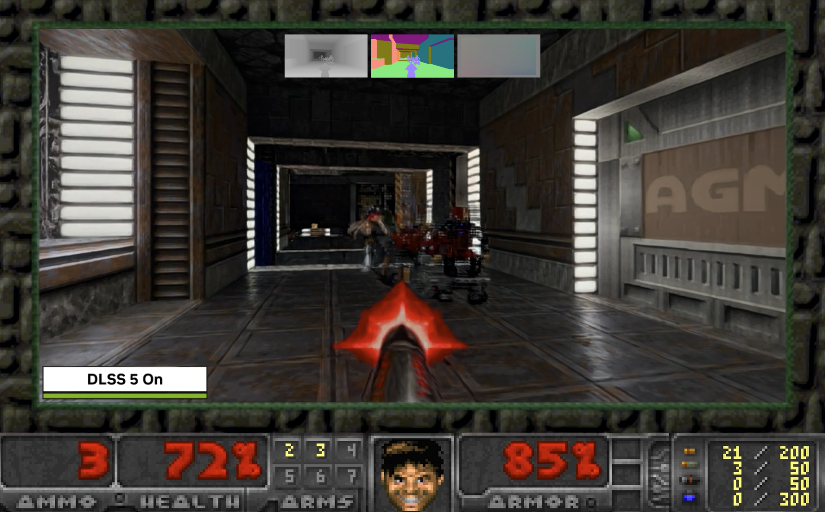
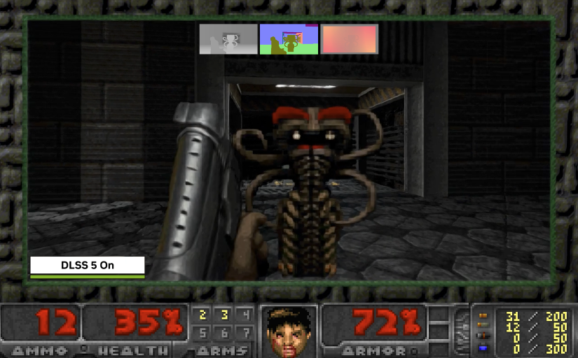
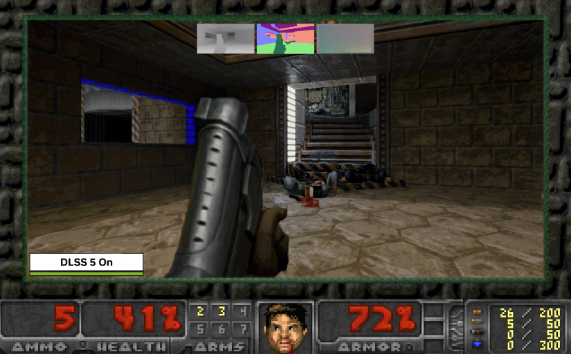

# DOOM + DLSS 5

Windows x64 port of Linux DOOM 1.10. The game still draws 320x200;
the window is 1280x800 (D3D12). Each frame also writes depth, normals, and motion.

[YouTube Demo - Link](https://www.youtube.com/watch?v=KFZ5NHp2Wj0)

| | | |
|:---:|:---:|:---:|
|  |  |  |

Copyright (C) 2026 Nikolai Zhivotenko. GPLv2, see LICENSE.TXT.
Original game code: id Software, 1993-1996. Carmack's note: README.TXT.

## First run

1. Put an IWAD in `wads/` (`freedoom2.wad`, `doom2.wad`, …).
2. In PowerShell (from this folder):

       .\build.cmd
       .\play-windoom.cmd

`cmd.exe` can run `build.cmd` without `.\`.

## Present modes

`build.cmd` copies `windoom.exe` into a folder per mode:

| Folder | Flag | What you see |
|---|---|---|
| `windoom-original` | *(default)* | Nearest 4x |
| `windoom-ngx-dlss3.5` | `--ngx-dlss3.5` | DLSS Ray Reconstruction |
| `windoom-ngx-dlss4` | `--ngx-dlss4` | DLSS Super Resolution, preset K |
| `windoom-ngx-dlss4.5` | `--ngx-dlss4.5` | DLSS Super Resolution, preset L |
| `windoom-ngx-dlss5` | `--ngx-dlss5` | Same as 4.5, then DLSS 5 NR if Swapper is installed |
| `windoom-anime4k` | `--anime4k` | Anime4K Fast Mode C |
| `windoom-fsr2` | `--fsr2` | AMD FSR 2.2 |

       .\build.cmd --all
       .\play-windoom.cmd --ngx-dlss4.5

`--all` builds every folder. Flags can be combined. NVIDIA and FSR2
SDKs are fetched into gitignored `third_party/` (not in git).
Details: `win32/README-NGX.md`, `win32/README-ANIME4K.md`,
`win32/README-FSR2.md`.

`play-windoom.cmd` starts the exe from that folder so DLLs stay local.
Unknown args are passed through (`-playdemo`, `-nodlss`, `-nofsr2`,
`-color`, `-depth`, `-normal`, `-velocity`, `-export <dir>`).

       .\play-windoom.cmd --ngx-dlss4 -nodlss

## Screencast and PNG export

       .\screencast-windoom.cmd

Plays `compare.lmp` once per mode (needs `--all` and the demo in
`build-win\Release`). Windows open one at a time.

       .\screencast-windoom.cmd --export D:\frames

Also writes every frame as `D:\frames\<folder>\f000001.png`, …
Same thing for one run:

       .\play-windoom.cmd --ngx-dlss5 -playdemo compare -export D:\frames\dlss5

`-export` runs one game tic per frame (35 fps timeline; playback is
just slower). PNGs match the window, including HUD and F1–F4 views.

       ffmpeg -framerate 35 -i D:\frames\windoom-ngx-dlss5\f%06d.png -c:v libx264 -pix_fmt yuv420p dlss5.mp4

## DLSS 5 Swapper

Point Swapper at `build-win\Release\windoom-ngx-dlss5` (not the
Release root). DirectX 12, **Native**. Do not drop your own
`dxgi.dll` in that folder first. See `win32/README-NGX.md`.

## Keys

    WASD          move
    arrows        also move
    mouse         turn
    fire          left button
    Esc           menu
    Y / N         quit prompt
    F1 F2 F3 F4   color, depth, normals, velocity
    Insert        show / hide status bar

`-color` / `-depth` / `-normal` / `-velocity` select the same views
from the command line (useful with `-playdemo`).

## Tree

    linuxdoom-1.10/   original sources
    win32/            Windows video, sound, G-buffers, present paths
    wads/             IWADs
    CMakeLists.txt    `windoom` target

G-buffer formats: `win32/README-GBUFFER.md`.
